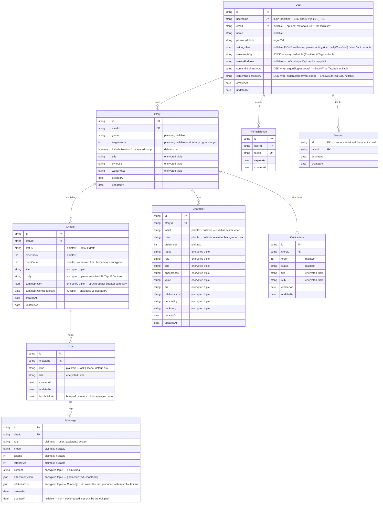

# Data Model

Authoritative reference for the Prisma schema ([backend/prisma/schema.prisma](../backend/prisma/schema.prisma)). Field shapes match the schema; review this doc whenever the schema changes.

**Narrative content is ciphertext-only.** Every narrative text field is stored solely as an AES-256-GCM triple (`<field>Ciphertext` / `<field>Iv` / `<field>AuthTag`) — the plaintext mirror columns were dropped in the E-series. The repo layer is the encrypt-on-write / decrypt-on-read seam (see [repo-boundary.md](./agent-rules/repo-boundary.md)); the envelope model (per-user DEK, two wraps, no server-held KEK for content) lives in [encryption.md](./encryption.md). Below, an encrypted field is shown as one logical row annotated "encrypted triple" rather than enumerating its three columns.

---

## Entity Relationship Diagram

> `Session` holds no DEK — only an in-process map does. The row exists so a restart or cold replica can detect "session expired" and force re-authentication instead of silently failing.

---

## Relationships & Cascade Behaviour

| Parent → Child | FK | Cascade | Rationale |
|---|---|---|---|
| User → Story | `Story.userId` | `onDelete: Cascade` | Account delete removes all user-owned writing. |
| User → RefreshToken | `RefreshToken.userId` | `onDelete: Cascade` | Session records vanish with the account. |
| User → Session | `Session.userId` | `onDelete: Cascade` | DEK-survival rows vanish with the account. |
| Story → Chapter | `Chapter.storyId` | `onDelete: Cascade` | A story has no meaning without its chapters. |
| Story → Character | `Character.storyId` | `onDelete: Cascade` | Characters are scoped to a single story. |
| Story → OutlineItem | `OutlineItem.storyId` | `onDelete: Cascade` | Outline lives inside the story it belongs to. |
| Chapter → Chat | `Chat.chapterId` | `onDelete: Cascade` | Chats are bound to the chapter they were opened from. |
| Chat → Message | `Message.chatId` | `onDelete: Cascade` | Messages can't outlive their chat. |

---

## Indexes

| Table | Index | Purpose |
|---|---|---|
| User | `username` unique, `email` unique | `username` is the login lookup; `email` uniqueness is enforced when present. |
| Session | `(userId)`, `(expiresAt)` | Per-user lookup + expiry sweeps. |
| Story | `(userId)` | List-stories-for-user is the hot path. |
| Chapter | `@@unique(storyId, orderIndex)`, `(storyId)` | Ordered render + the race guard on insert (the unique btree also serves the `ORDER BY orderIndex`). |
| Character | `@@unique(storyId, orderIndex)`, `(storyId)` | Sidebar cast + ordered render; same race guard. |
| OutlineItem | `@@unique(storyId, order)`, `(storyId)` | Outline sidebar + drag-reorder; same race guard. |
| Chat | `(chapterId)`, `(chapterId, kind)`, `(chapterId, lastActivityAt)` | List chats for the open chapter, filter by kind, order by recency. |
| Message | `(chatId)`, `(chatId, createdAt)` | Chronological log render. |
| RefreshToken | `token` unique, `(userId)` | Cookie lookup + per-user revocation. |

---

## Field Conventions

- **IDs** are CUIDs (`String @id @default(cuid())`), never incrementing integers, so they're safe to expose in URLs. Exception: `Session.id` is the random hex `sessionId` minted at login (no `cuid()` default).
- **Timestamps** — every narrative model has `createdAt` + `updatedAt`. `Message.updatedAt` is **nullable** (`null` = never edited; set only by the in-place edit path, deliberately not `@updatedAt`) — `Message` is no longer append-only. `Session` and `RefreshToken` are `createdAt`-only by design.
- **JSON columns** — only `User.settingsJson` is a live Postgres `JSONB` column. The narrative JSON payloads (TipTap body, chat attachment, citations) are serialised to strings and stored encrypted as ciphertext triples, not as JSONB.
- **Encrypted columns are nullable** — a full-null triple means the field was stored as `null`; a partial triple is a corruption signal (the repo throws).
- **Status enums are strings**, not Prisma enums, so the UI can add states without a migration (`Chapter.status`, `OutlineItem.status`, `Chat.kind`, `Message.role`).

---

## Derived Fields

- `Chapter.wordCount` — computed from the decrypted TipTap tree **before** encryption on each write, stored as a plaintext column. Never derived at read time and never derivable from ciphertext.
- Per-story aggregates (`chapterCount`, `totalWordCount`) — computed on demand in `GET /api/stories` via a single chapter `groupBy`, not stored on `Story`.

---

## Encryption at rest

Every narrative text field exists **only** as a ciphertext triple (`<field>Ciphertext` / `<field>Iv` / `<field>AuthTag`); there is no plaintext mirror. The full per-field column list, the per-user DEK envelope model (two argon2id wraps on `User`, no server-held KEK for content), and the recovery-code path live in [encryption.md](./encryption.md). The repo layer (`backend/src/repos/*.repo.ts`) is the only code that reads or writes these columns — every read decrypts, every write encrypts, and the API surface never sees ciphertext ([repo-boundary.md](./agent-rules/repo-boundary.md)). `APP_ENCRYPTION_KEY` protects the BYOK Venice keys only and has no authority over narrative content.
