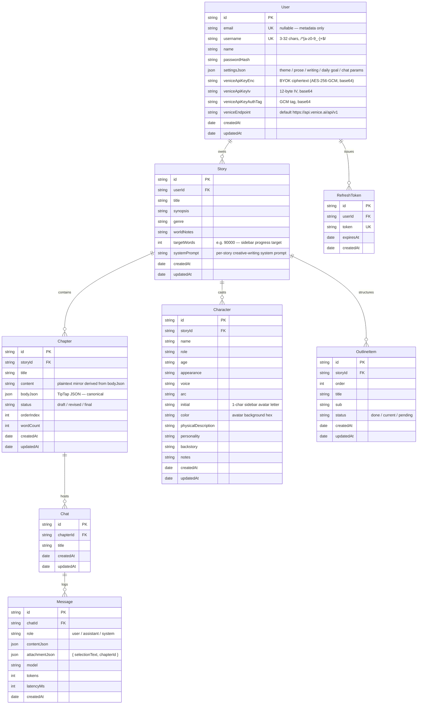

# Data Model

Authoritative reference for the Prisma schema ([backend/prisma/schema.prisma](../backend/prisma/schema.prisma)). Field types match the schema exactly; review this doc whenever the schema changes. Encrypted-at-rest columns described here are the **plaintext columns** that exist today — the ciphertext triples from the E-series will be added additively and documented in [encryption.md](./encryption.md).

---

## Entity Relationship Diagram

---

## Relationships & Cascade Behaviour

| Parent → Child | FK | Cascade | Rationale |
|---|---|---|---|
| User → Story | `Story.userId` | `onDelete: Cascade` | Account delete removes all user-owned writing. |
| User → RefreshToken | `RefreshToken.userId` | `onDelete: Cascade` | Session records vanish with the account. |
| Story → Chapter | `Chapter.storyId` | `onDelete: Cascade` | A story has no meaning without its chapters. |
| Story → Character | `Character.storyId` | `onDelete: Cascade` | Characters are scoped to a single story. |
| Story → OutlineItem | `OutlineItem.storyId` | `onDelete: Cascade` | Outline lives inside the story it belongs to. |
| Chapter → Chat | `Chat.chapterId` | `onDelete: Cascade` | Chats are bound to the chapter they were opened from. |
| Chat → Message | `Message.chatId` | `onDelete: Cascade` | Messages can't outlive their chat. |

---

## Indexes

| Table | Index | Purpose |
|---|---|---|
| User | `email` unique, `username` unique | Login lookup; uniqueness enforcement. |
| Story | `(userId)` | List-stories-for-user is the hot path. |
| Chapter | `(storyId)`, `(storyId, orderIndex)` | List chapters; ordered render without a sort. |
| Character | `(storyId)` | Sidebar cast + prompt-builder fetch. |
| OutlineItem | `(storyId)`, `(storyId, order)` | Outline sidebar + drag-reorder. |
| Chat | `(chapterId)` | List chats for the open chapter. |
| Message | `(chatId)`, `(chatId, createdAt)` | Chronological log render. |
| RefreshToken | `token` unique, `(userId)` | Cookie lookup + per-user revocation. |

---

## Field Conventions

- **IDs** are CUIDs (`String @id @default(cuid())`), never incrementing integers, so they're safe to expose in URLs.
- **Timestamps** — every narrative model has `createdAt` + `updatedAt`. `Message` is append-only (`createdAt` only).
- **JSON columns** (`Chapter.bodyJson`, `User.settingsJson`, `Message.contentJson`, `Message.attachmentJson`) are Postgres `JSONB`; Prisma types them as `Prisma.JsonValue` / `Prisma.InputJsonValue`.
- **Nullable vs required** — narrative prose fields (`synopsis`, `notes`, etc.) are nullable; structural fields (FKs, `orderIndex`, `status` with a default) are required.
- **Status enums are strings**, not Prisma enums, so the UI can add new states (`Chapter.status`, `OutlineItem.status`, `Message.role`) without a migration.

---

## Derived Fields

- `Chapter.wordCount` — computed from `bodyJson` in backend code before write ([B10]). Never derived at read time; never derived from ciphertext once [E5] lands.
- `Story` progress (`X / Y words · Z%`) — computed on demand in `GET /api/stories/:id/progress` ([B9]).

---

## Encryption Surface (Preview — E-series)

Narrative text columns listed above will gain `*Ciphertext / *Iv / *AuthTag` siblings during the E-series. Plaintext mirrors stay in place during dual-write rollout ([E4]–[E8]) and are dropped in [E11]. `Chapter.content` is intentionally dropped — TipTap JSON decrypted via the chapter repo becomes the sole source of truth. Full column-by-column list and the KEK / DEK model live in [encryption.md](./encryption.md).
